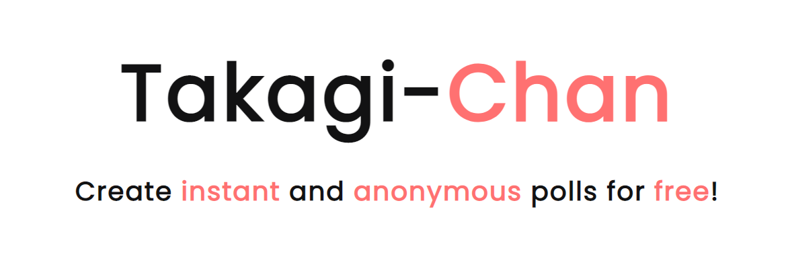

<p align="center">
  <br />
</p>

***


[](https://www.gnu.org/licenses/gpl-3.0)

Source code of **Takagi**, a simple web application build with **Flask** and **Vue.js** used to conduct quick and anonymous polls over the internet.

> 🔥 Takagi was built as an assignment for my university Web-Dev course.

Takagi may lack certain business features because everything was done by me, that includes,     
design, architecture, backend, frontend, testing and a lot of DevOps-y stuff in a limited amount of time.

> 👑 It's alive! Check it out live at [takagi.bednarski.dev](https://takagi.bednarski.dev/)!

<p align="center">
	
</p>

## 🛠 Best Features

**Takagi is CDD (CV Driven Development) in the nutshell!**

Below are the features I had the most fun developing.

-   Simplified **JWT based authentication system** for users saving their polls.

-   Managed **Sentry** used for application monitoring and exception tracking.

-   **CI/CD** pipelines for automatic building and deploying on my infrastructure build on top of **GitHub Actions**.

-   Simple **End-To-End tests** build with the **Cypress** testing framework run before each frontend deploy by CI/CD system to achieve the best user experience.

<br>

### Backend Specific
- **Functional tests** for the API service build with **PyTest** and **Requests** modules.

- Python 3 (Flask) **RESTful** API build on top of **MongoDB** for storing application state.

- **Redis** based, cluster ready, **application-level rate limiting** on some of the API service endpoints.

 - Monitoring `/api/health` endpoint with the most valuable **performance counters** from **Redis**,
	hooked up to my **Telegraf**, **InfluxDB** and **Grafana** metric monitoring infrastructure (*Cool graphs!* 🤓)

- Fully **Dockerized** development workflow, taking advantage of **docker-compose** for developing, testing and deployments.

<br>

### Frontend Specific
- Beautifully designed **SPA** frontend build with **Vue.js** and **Vue-Router**.

- **Valve's Fingerprint.js 2** library used for identifying users to avoid duplicated votes.

- **Client-side forms validation** build with **Vee-Validate** used for achieving better user experience.

<br>

That's all I can remember... 😉

<br>

## 💻 Running Locally

**It's easy to get started with developing Takagi!**

This project uses **Docker** as a development and production deployment tool, so **you need It** first!

<br>

### Backend
> 💡 Execute every command in the `./backend` directory!

**If you only want to run It**, you need to:
- Spin up the whole stack as containers, simply type:

  ```bash
  docker-compose up -d
  ```

This will spin up all the necessary containers and expose Takagi service **API** at `http://127.0.0.1:5000`.

<br>

**If you want to make changes** to the **Flask** app, you need to:
- Install **Python 3.8**, then projects requirements.

  ```bash
  pip3 install -r requirements.txt
  ```

- Also, It's *optionally* development requirements.

  ```bash
  pip3 install -r dev-requirements.txt
  ```

- After that spin up **Redis** and **MongoDB** as containers.

  ```bash
  docker-compose up -d redis mongo
  ```

- Run `main.py`, entry point for Flask app.

  ```bash
  python3 ./main.py
  ```

  This will spin up databases, and run Python code with the development server at `http://127.0.0.1:5000`.

<br>

### Frontend
> 💡 Execute every command in the `./frontend` directory!

If **you want to make changes** to the **Vue.js** app, you need to:
- Install **NPM**, then projects requirements.

  ```bash
  npm install
  ```

- To then serve a website, simply type:

  ```bash
  npm run serve
  ```

This will create a development web server at `http://127.0.0.1:8080`.
And It's a lot simpler!

<br>

## 📋 Running Tests

**Takagi has a simple set of functional tests!**

This project uses **PyTest**, **PyLint** and **Cypress** as a testing tools, so **you need them** first!

- To run **backend tests**, run Takagi API service and in the `./backend` directory type:

  ```bash
  pytest .
  ```

- To run **backend lint**, run in the `./backend` directory:

  ```bash
  pylint ../backend
  ```

- To run **Cypress E2E** tests, with everything running, open dashboard by typing:

  ```bash
  npm run open
  ```

	This will open a dashboard that will let you run all the specs.

<br>

## 🚧 Contributing

**You are more than welcome to help me improve Takagi!**

Just fork this project from the `master` branch and submit a Pull Request (PR).  
It's probably a good idea to run all the tests beforehand.

<br>

## 📃 License
This project is licensed under [GPL-3.0](https://choosealicense.com/licenses/gpl-3.0/) .
